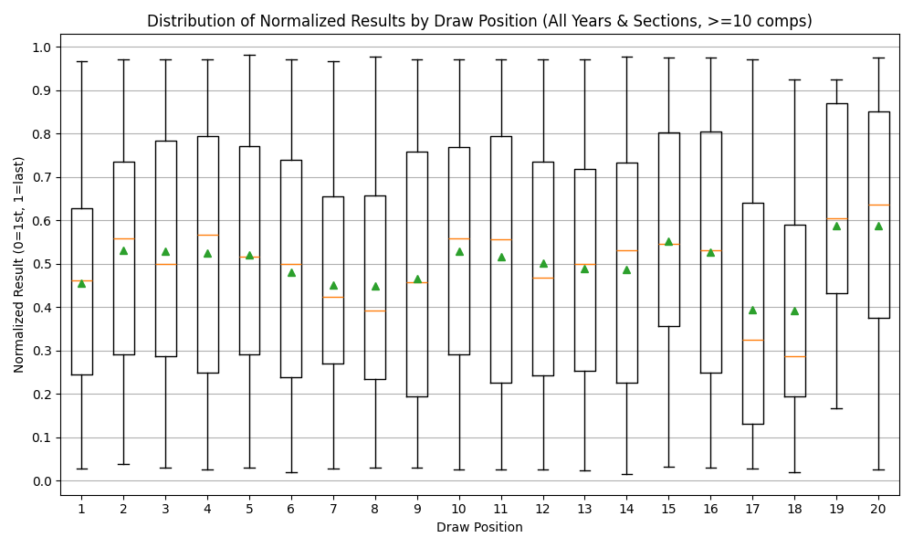
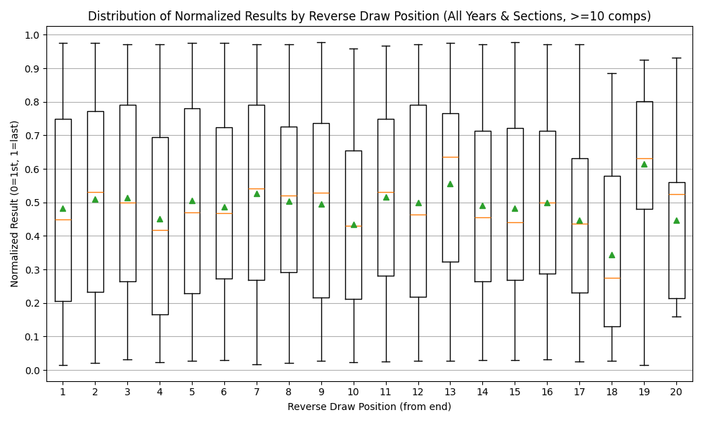
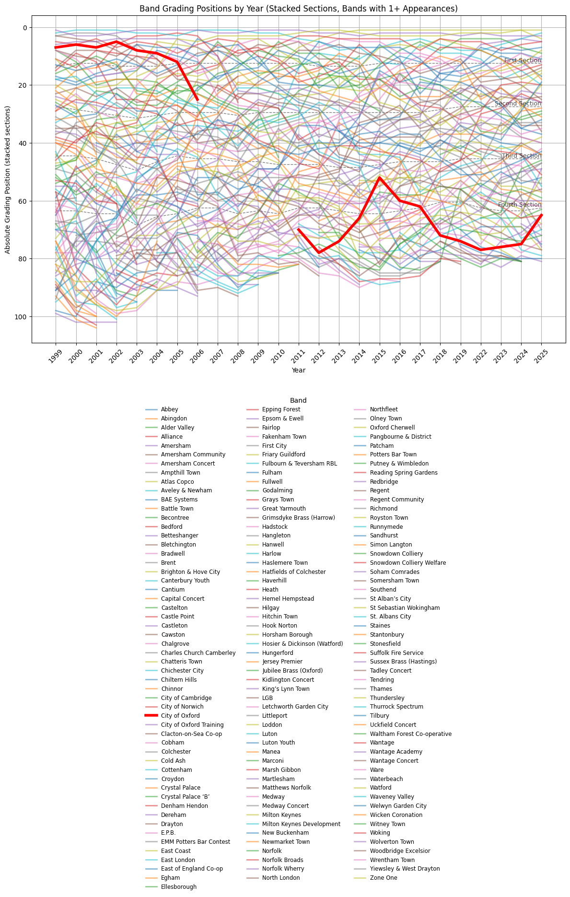

# Unveiling the Impact of Draw Position in Brass Band Contests: A Data-Driven Analysis

## Introduction

Brass bands often take part in contests. One major UK contest is the Brass Band National Championships. These consist of two parts: regional qualifying contests and the national finals.

The country is divided into several regions, such as London & Southern Counties, Yorkshire, North West, Midlands, and others. Each region holds its own annual contest, where bands compete in one of five sections: Championship, First, Second, Third, and Fourth. The sections reflect the standard and experience of the bands, with Championship being the highest level.

Bands are assigned to sections based on their grading, which is updated each year according to contest results. The top bands from each section and region qualify for the National Finals, where they compete for national titles. The competitions are blind judged so the adjudicator doesn't know which band is playing.

One question often debated is whether the order in which bands perform their final result. Are there positions which are particularly bad or good? In this post, I analyze historical contest data from the London & Southern Counties region, exploring the relationship between draw position and contest outcomes.

I also have some pretty graphs showing positions over time.

## Data Collection

I scraped contest results and grading tables from the official [London & Southern Counties Brass Band Contest](https://www.regional-contest.org.uk/lsc/) website, covering years from 1999 to 2025. The dataset includes five sections per year, with each band's draw position, result, and grading information. Challenges included inconsistent table formats and duplicate positions. For the duplicate positions I used [brass band results](https://www.brassbandresults.co.uk/) to manually fix those results.

In total, this analysis covers 125 individual competitions held in the London & Southern Counties region from 1999 to 2025, across all sections and years. For those who multiplied 26 and 25 and got 130, there
was no competitions in 2020 due to Covid.

## Data Normalization

Band names often appear in multiple variants (e.g., "City of Oxford Band", "City of Oxford Silver"). For the main analysis this is irrelevant as we only care about result vs draw position.

For plotting result vs draw position, the results were normalized using an unbiased formula to ensure fair comparison across contests of different sizes. Instead of simply using `i/n`, we use:

$k = (2 × p - 1) / (2 × n)$$

Where `p` is the band's rank (1 for first, 2 for second, etc.) and `n` is the number of bands in the contest. This method spaces the bands evenly between 0 and 1, with the first place at $1/(2n)$ and the last at $1 - 1/(2n)$. It avoids bias at the endpoints and ensures the mean normalized place is 0.5.

## Visualization

I looked at two things: whether being ranked some place relative to the beginning was good or bad, and whether being ranked some place relative to the end was good or bad.

To explore the data, I created a pair visualizations:

- **Draw Position vs. Result:**
  
  A box-and-whisker plot showing the distribution of normalized results by draw position. The y-axis is normalized so that 0 represents 1st place and 1 represents last place.

- **Reverse Draw Position Analysis:**
  
  This plot examines results based on position from the end of the draw, revealing whether late performers are advantaged or disadvantaged.

In both of these I dropped any draw/reverse-draw position where fewer than 10 bands were placed because there is not much data.

This suggests a few interesting things: 
 - Any bias is fairly small.
 - Playing first is slightly advantageous. 
 - Playing 7th and 8th may be slightly advantageous.
 - Playing near the end doesn't matter much.

However none of the results seem clear enough without statistical analysis.

## Statistical Analysis

I computed the mean and variance of normalized results for each draw position and performed Kolmogorov-Smirnov tests to compare the observed distributions to a uniform distribution. The results are summarized in the tables below:

**Draw Position Analysis vs Uniform Distribution**

| Draw | N   | Mean  | Std   | KS_stat | KS_pval |
|------|-----|-------|-------|---------|---------|
| 1    | 124 | 0.456 | 0.261 | 0.141   | 0.013   |
| 2    | 121 | 0.532 | 0.270 | 0.095   | 0.211   |
| 3    | 120 | 0.529 | 0.282 | 0.083   | 0.356   |
| 4    | 122 | 0.525 | 0.300 | 0.088   | 0.281   |
| 5    | 122 | 0.520 | 0.280 | 0.086   | 0.313   |
| 6    | 123 | 0.480 | 0.286 | 0.081   | 0.381   |
| 7    | 122 | 0.451 | 0.255 | 0.122   | 0.048   |
| 8    | 122 | 0.449 | 0.286 | 0.116   | 0.068   |
| 9    | 123 | 0.466 | 0.304 | 0.097   | 0.184   |
| 10   | 123 | 0.529 | 0.283 | 0.069   | 0.575   |
| 11   | 120 | 0.517 | 0.312 | 0.075   | 0.486   |
| 12   | 115 | 0.502 | 0.288 | 0.044   | 0.970   |
| 13   | 98  | 0.489 | 0.291 | 0.071   | 0.684   |
| 14   | 91  | 0.487 | 0.296 | 0.082   | 0.545   |
| 15   | 84  | 0.553 | 0.278 | 0.118   | 0.181   |
| 16   | 65  | 0.527 | 0.296 | 0.088   | 0.663   |
| 17   | 42  | 0.395 | 0.306 | 0.223   | 0.026   |
| 18   | 24  | 0.392 | 0.268 | 0.236   | 0.116   |
| 19   | 13  | 0.587 | 0.273 | 0.202   | 0.592   |
| 20   | 12  | 0.588 | 0.334 | 0.242   | 0.419   |

**Reverse Draw Position Analysis vs Uniform Distribution**

| ReverseDraw | N   | Mean  | Std   | KS_stat | KS_pval |
|-------------|-----|-------|-------|---------|---------|
| 1           | 122 | 0.482 | 0.296 | 0.072   | 0.524   |
| 2           | 121 | 0.509 | 0.309 | 0.072   | 0.535   |
| 3           | 121 | 0.515 | 0.290 | 0.064   | 0.673   |
| 4           | 122 | 0.450 | 0.298 | 0.096   | 0.200   |
| 5           | 122 | 0.505 | 0.304 | 0.073   | 0.506   |
| 6           | 123 | 0.487 | 0.280 | 0.075   | 0.467   |
| 7           | 121 | 0.527 | 0.296 | 0.112   | 0.091   |
| 8           | 122 | 0.505 | 0.280 | 0.054   | 0.850   |
| 9           | 124 | 0.495 | 0.303 | 0.069   | 0.581   |
| 10          | 118 | 0.434 | 0.268 | 0.139   | 0.019   |
| 11          | 121 | 0.517 | 0.267 | 0.074   | 0.504   |
| 12          | 117 | 0.499 | 0.300 | 0.073   | 0.543   |
| 13          | 98  | 0.557 | 0.267 | 0.148   | 0.024   |
| 14          | 92  | 0.490 | 0.269 | 0.074   | 0.672   |
| 15          | 82  | 0.484 | 0.285 | 0.081   | 0.625   |
| 16          | 62  | 0.500 | 0.261 | 0.092   | 0.636   |
| 17          | 44  | 0.447 | 0.261 | 0.169   | 0.143   |
| 18          | 25  | 0.344 | 0.263 | 0.319   | 0.009   |
| 19          | 14  | 0.614 | 0.251 | 0.286   | 0.167   |
| 20          | 11  | 0.448 | 0.263 | 0.243   | 0.462   |

Key findings:
- Draw positions 1 has a p-values of 0.026 indicating possible bias for bands drawn first.
 17th also has a bias but that seems odd, from the forward draw perspective.
- Reverse draw position 17th and 18 show some bias but that seems mostly explainable by the fact that they were draw 1st for around half of their draws.
- Most other draw positions do not show significant deviation (p > 0.05). There are a few which are under 0.05 but we have 40 tests here so the raw p values need to be taken with a grain of salt.

## Pretty graphs

I also created a pretty graph of the position of bands over time, highlighting my band.

**Grading Positions by Year:**

## Conclusions

Where you are drawn doesn't matter much, but going first is slightly helpful. Perhaps playing the national anthem on stage helps prepare for the acoustics and also calm the nerves.

---

*Copilot with GPT-4.1 helped write a lot of the code and also part of the blog.*
